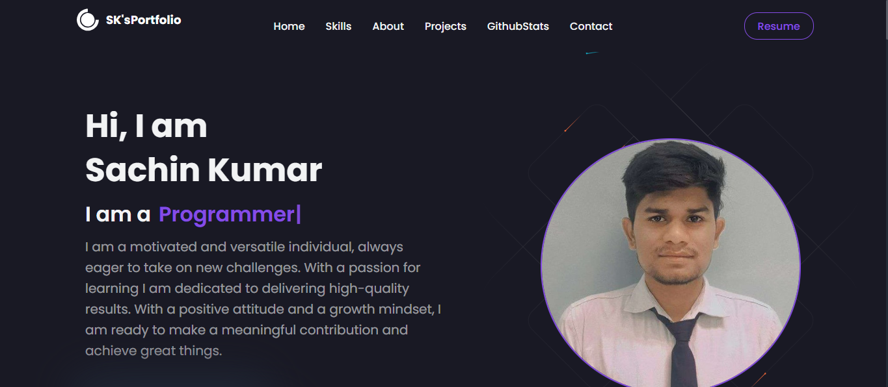
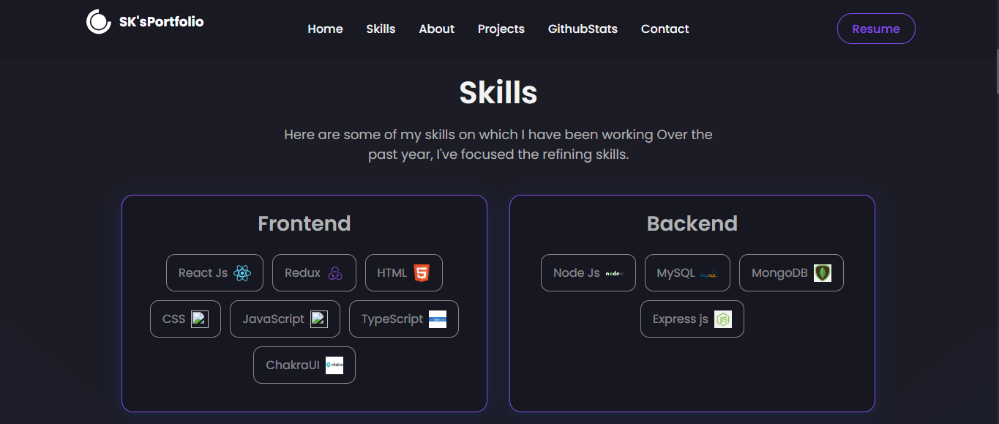
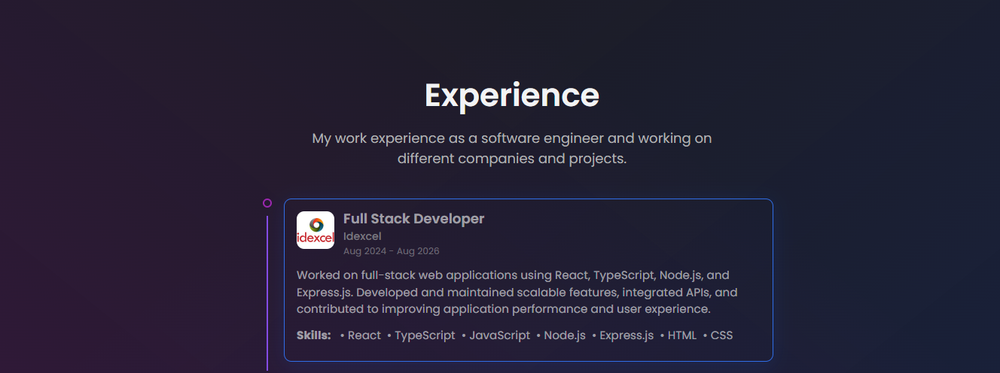
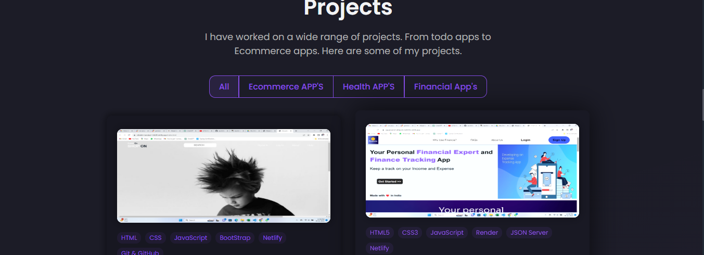
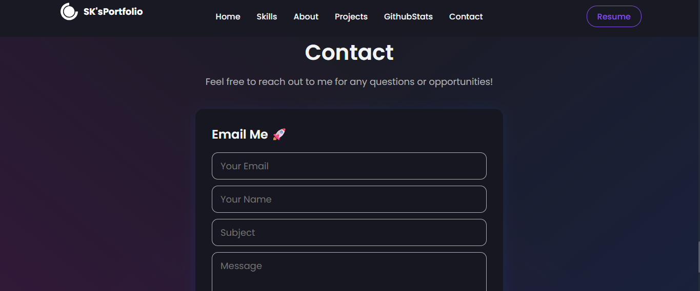

# Sachin Kumar — Developer Portfolio

A personal portfolio website showcasing my skills, professional experience, projects, and contact information as a Full Stack Developer.

## 🚀 About Me

Hi, I'm Sachin Kumar, a Full Stack Developer with experience building and maintaining web applications using modern frontend and backend technologies.

I enjoy building scalable, user-friendly applications and continuously improving my skills in software development.

## 🌐 Portfolio

The portfolio website provides an overview of:

- 👨‍💻 Professional experience
- 🛠️ Technical skills
- 🚀 Projects
- 📊 GitHub activity
- 📬 Contact information
- 📄 Resume

## ✨ Features

- Responsive portfolio design
- Smooth navigation between sections
- Skills categorized into Frontend and Backend
- Professional experience timeline
- Project showcase with technology tags
- Project category filtering
- GitHub statistics
- Contact form with email integration
- Resume access
- Responsive UI for different screen sizes

## 🛠️ Tech Stack

### Frontend

- React.js
- JavaScript
- TypeScript
- HTML5
- CSS3
- Redux
- Chakra UI

### Backend

- Node.js
- Express.js
- MongoDB
- MySQL

### Other Tools & Services

- Git
- GitHub
- Netlify
- EmailJS

## 📸 Screenshots

### 🏠 Home

The landing section introduces me and provides a quick overview of my profile.



---

### 🛠️ Skills

The skills section highlights my frontend and backend technologies.



---

### 💼 Experience

The experience section presents my professional experience as a Full Stack Developer.



---

### 🚀 Projects

The projects section showcases applications I have built across different categories, including e-commerce, health, and financial applications.



---

### 📬 Contact

Visitors can use the contact form to get in touch with me regarding opportunities or other inquiries.



## 📂 Project Structure

```text
src/
├── components/
├── pages/
├── assets/
├── styles/
├── App.js
└── index.js

public/
└── images/

screenshots/
├── home.png
├── skills.png
├── experience.png
├── projects.png
└── contact.png
